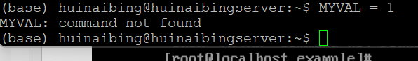
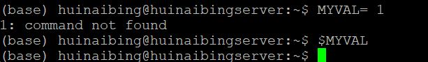
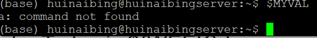
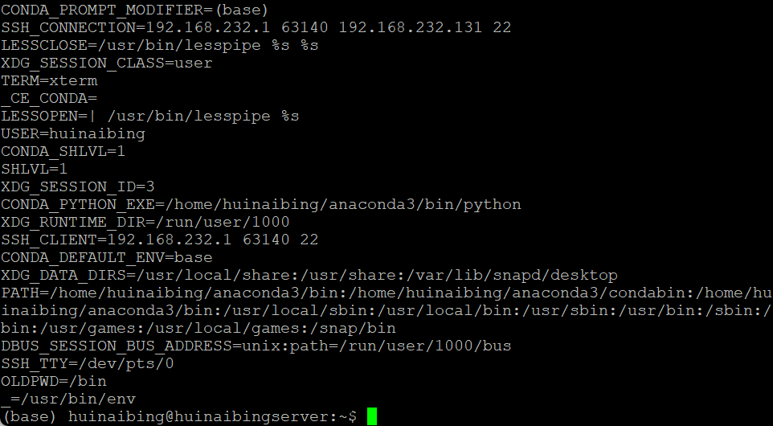

> 本笔记基于尹航老师与张清国老师的课件，主要是shell编程，基本命令懒得写

# 简单的shell

一个shell通常开头要

```
#! /bin/sh
```

这个用`#! /bin/bash`貌似也可以，但是我经常不写这个

写完后需要`chmod`一下，这样可以使用`./`去执行，但是我直接`sh shell.sh`这样省事

# 变量

显然分为自定义变量和环境变量，通常字母全部大写，这个是编程习惯不遵守也行

```
$VARIABLE=value
```

上面的定义不能加空格，要加的话也要用`“”`引号



显然，shell把它当成命令了



同理，shell把1当成命令了

输出变量在前面加$

```
echo $MYVAL
echo ${MYVAL}
```



注意的这里的command not found，这说明shell直接把$MYVAL当成指令了，显然这个可以用于简化一些编程操作

`unset`可以删除一个变量，`set`不带参数可以显示所有变量（包括用户的），`env` `printenv`也可以，但是只**显示系统的**



测试一下
[111111](/test/tests)