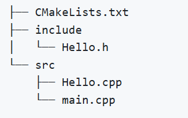
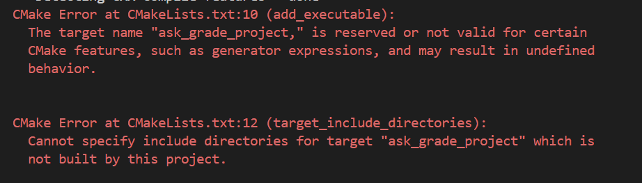

# c++

## 文件IO

输出

```cpp
#include <fstream>

ofstream out("out.txt"); // 这是打开一个文件用于存储东西，cpp格式
out << datas << endl; // 像cout一样把datas存入out.txt
out.close();

File* out2 = fopen("out2.txt", "w"); // 这是c格式的打开文件存储东西
fprintf(out2, "%d\n", datas); // 像printf一样把datas放入out2.txt，和printf不一样的是这里要指定文件指针
fclose(out2);
// 注意两种文件io的关闭方式不一样
```

输入

```cpp
ifstream in("input.txt"); // 和上面对称的
while(!in.eof())
{
	in >> datas >> datas2; // 适合读取csv这种文件
}

string buffer;
while(getline(in, buffer))
{
    sscanf(buffer.c_str(), "%d %f %f", &val1, &val2, &val3);
    // 显然这个是对标c的一种读取方法，但是用了cpp的东西
}
```

## 指针、引用、值传递、地址传递、指针传递

[原文](https://www.runoob.com/w3cnote/cpp-difference-between-pointers-and-references.html)

```cpp
int m;
int &n = m;
// n可以认为是m的第二个名字
// n被创建的时候必须被初始化，初始化完成后，n和m绑定且不可解散
// &可以被看做取地址符号，写成int* n = &m其实更容易理解，如下图
```


小技巧：通过改变传给函数的参数的引用，达到返回值的目的


# cmake

[参考runoob](https://www.runoob.com/cmake/cmake-basic.html)

[参考2github](https://github.com/ttroy50/cmake-examples/tree/master)

```cmake
# 指定版本
cmake_minimum_required(VERSION 3.5)

# 指定项目名称
project(my_project_name)

# 添加需要编译的文件
add_executable(${PROJECT_NAME} main.cpp)
```

使用cmake

```sh
cmake .
# 显然，给cmake指令CmakeList.txt的位置就行，但是有个问题就是cmake会把所有东西放在执行cmake的地方的地方
cd build
cmake ..
# 显然，这种方法可以避免上面的问题
```

## 一个标准的小项目



实现这样一个小小的项目的CMakeList需要如下几步

```cmake
# 版本
cmake_minimum_required(VERSION 3.5)
# 项目名称
project(hello_project)
# 指定所有需要参加编译的cpp
# 注意这里可以理解为定义了一个变量，这个变量包含两个cpp文件
set(SOURCES
	src/Hello.cpp
	src/main.cpp
)
# 将文件们添加到可执行文件
add_executable(hello_project ${SOURCES})
# 把include文件夹（头文件们）包括进来
target_include_directories(hello_project
	PRIVATE
		${PROJECT_SOURCE_DIR}/include
)
# 显然project source dir就是指的项目根目录，cmakelist文件的位置
```



`add_executable`后面 **不要加逗号** **不要加逗号** **不要加逗号** **不要加逗号** **不要加逗号** **不要加逗号** **不要加逗号** **不要加逗号** **不要加逗号** **不要加逗号** **不要加逗号** **不要加逗号** **不要加逗号** **不要加逗号** **不要加逗号** **不要加逗号** **不要加逗号** **不要加逗号** **不要加逗号** **不要加逗号** **不要加逗号** **不要加逗号** **不要加逗号** **不要加逗号** **不要加逗号** **不要加逗号** **不要加逗号** **不要加逗号** **不要加逗号** **不要加逗号** **不要加逗号** **不要加逗号** **不要加逗号** **不要加逗号**
