> 教材：粒子探测技术（汪晓莲 李澄 等）
>
> 使用了王亚平老师的ppt

# 方便我打字的神奇妙妙工具

> 在这里放一段公式以便复制粘贴
>
> ```latex
> $$
> \begin{align}
> 
> \end{align}
> $$
> ```

# 第一章

过于简单，略过大部分

单位Ci（居里）表示一秒内衰变3.7e10个核，1Ci = 3.7e10Bq，1Bq也就是1秒衰变一个原子核

# 第二章 粒子探测物理基础

## 2.1 带电粒子和物质的相互作用

主要有以下几个类别

- 非弹性碰撞（使带电粒子损失能量）
  - 带电粒子和核外电子（就是高中讲的那个激发和电离）
    - 电子的电离
    - 激发
  - 带电粒子和原子核
    - 轫致辐射（刹车辐射，ren这个字不好打），即带电粒子减速刹车时发出的电磁辐射
    - 电子对直接产生（这个尚且不明确，留白）
    - 光核作用（photonuclear）（论文上提到这个，留白）

- 弹性碰撞（通常能量损失不是很严重，当然只是通常）
  - 带电粒子和核外电子（没有跃迁和电离，和上面的不一样）
  - 带电粒子和原子核（卢瑟福散射，原子物理学那个）
    - 多次卢瑟福散射
- 切伦科夫辐射（介质中带电粒子的运动速度超过该介质中的光束【速度大于电磁波在该介质中相速度】，就会发出辐射，以短波为主，主要是蓝色的还挺好看）
- 穿越辐射（带电粒子穿越两折射率不同的介质）

能量损失分为**电离能损**和**辐射能损**，而重离子的电离能损远大于辐射的


### 激发（高中那个）

激发过程的表达式如下：

$$
\begin{align}
	q^{\pm} + atom \rightarrow atom^* + q^{\pm} \rightarrow atom + \gamma
\end{align}
$$
激发后，原子退激发会发射光子，这个光子会给光电倍增管之类的后续一堆放大、检测器件

### 电离

一次散射，入射粒子能给**静止电子的最大动能**(入射粒子动量$p = \gamma m_0\beta c$)(这个自己推导去，作业有一题是这个)


$$
\begin{align}
T_{max} &= \frac{2 m_e c^2 \beta^2\gamma^2}{1 + 2 \gamma m_e / m_0 + (m_e / m_0)^2}
\\
&= \frac{2m_ep^2}{m_0^2 + m_e^2 + 2 m_eE / c^2}
\end{align}
$$


低能情况下（为什么是这个？因为第一个式子分母有这个，然后电子质量很小，$\gamma$也不大）


$$
\begin{align}
2\gamma m_e / m_0 \ll 1
\end{align}
$$


然后入射粒子很重


$$
\begin{align}
m_e < m_0
\end{align}
$$


结合上面两个公式可以把$T_{max}$上面的表达式化简（平方项舍去，第二项舍去）


$$
\begin{align}
T_{max} &=  2m_e c^2 \beta^2 \gamma^2
\end{align}
$$


由于电子质量特别小，所以一般都把平方项扔掉


$$
\begin{align}
T_{max} &= \frac{p^2}{\gamma m_0 + m_o^2 / 2 m_e} 
\end{align}
$$


对于相对论粒子，能量约等于动能，$pc \sim E$


$$
\begin{align}
E_{max} = \frac{E^2}{E + m_0^2 / 2m_e}
\end{align}
$$


注意这里的$E_{max}$是电子的动能，E是入射粒子的能量

在这个式子中可以发现，E特别大的时候，$E_{max} = E$，也就是能量全部传给电子了

如果入射的是电子，近似全部用不了，直接带第一个公式


$$
\begin{align}
T_{max} = \frac{p^2}{m_e + E / c^2}
\end{align}
$$


### 电离能损

BB公式


**注意：这里的$dE \over dx $**最好加一个$<>$代表平均的电离能损 

dx是**质量厚度**$dx = \rho dl = \frac{mdl}{V} = \frac{m}{ds}$(这里的dl是长度，ds是面积，和书上的不一样，dl的单位是cm，m的单位是g)，物理意义是单位面积的质量，那$dE / dx$的意义就是**单位面质量密度所损失的平均能量**，它的单位是$\frac{MeV}{g / cm^2}$

在**低能条件、入射粒子很重（看上面的公式）**下


其中


$$
\begin{align}
K = 4\pi N_A r^2_e m_e c^2 = 0.3071 \frac{MeV}{g / cm^2}
\end{align}
$$


注意这个公式，他直接用$E_{kin}$了，然而这个近似是在相对论粒子里面用的，所以这里不严谨，还是用$T_{max}$比较好


下图为**$\mu$穿越铜的图像**


显然，图中用带子分割了几个区域

1. 能量很低时，粒子运动速度和原子中电子的速度差不多，公式不怎么适用，这个图里没有这一段
2. 速度在$10^{-3} - \alpha z$之间，并且离边界很远，能损正比于速度，图中最左边
3. 在$0.01 - 0.05$之间，没有理论描述，图中左边两条带子的中间
4. 在图中BB区，用BB公式描述，一开始能损下降正比于$1 / \beta^2$，达到**最小电离粒子MIP**区域，轻的物质（Z / A ~ 0.5）这个能损大约为*$2 \frac{MeV}{g / cm^2}$*
5. 最右边，粒子能损主要是辐射能损，这个不用BB公式描述的


BB公式给的是能量损失的平均值，也就是能量损失是有一个分布的，

当粒子穿过稀薄气体的时候，能量损失的统计涨落很大，通常用廊道分布来描述


$$
\begin{align}
L(\lambda) &= \frac{1}{\sqrt{2\pi}} \exp{-\frac{1}{2}(\lambda + e^{-\lambda})}
\end{align}
$$


其中


$$
\begin{align}
\lambda &= \frac{\Delta E - \Delta p}{\xi} 
\end{align}
$$


注意这里的$\Delta p$是最概然能损（能损分布中几率最大的能损），不是动量（这都什么b符号约定）


对于厚的吸收层用高斯分布就行

这个大涨落原因是，介质的电子有机会获得相当大的能量，这个电子可以产生次级电离（$\delta$电子 ）

这个涨落大不大和入射粒子的速度和介质都有关系

- 当带电粒子通过时，涉及的最大能量转移次数多，用泊松或高斯分布$\frac{\beta^4}{(1 - \beta^2)} \ll 0.074x$
- 次数少（薄介质）$\frac{\beta^4}{(1 - \beta^2)} \gg 0.074x$，朗道分布

- 如果这个值介于中间，那就是瓦维洛夫分布，略

由于这个delta电子可能飞走导致测量出来的能量损失比真实能量损失小，所以会用截断能损，也就是只要能损小于一个阈值的那部分粒子，这样可以避免因能损过高，产生delta电子，delta电子飞走带来的测量能量误差影响


电离产额就是**入射粒子直接产生的电离数（原初电离）**加上**delta电子的次级电离**


当用混合物质去做探测器材料时


$$
\begin{align}
\frac{dE}{dx}&= \Sigma w_i \frac{dE}{dx} | i
\end{align}
$$


wi是这个物质的质量分数（为什么不用体积比例？）也就是加个权平个均


### 辐射能损

刹车辐射：带电粒子的速度和方向变了就会辐射，这个能损表达式：


要是考虑电子的贡献


如果入射的是电子，把电子的数据带进去


显然，注意到表达式可以写成


$$
\begin{align}
	\frac{dE}{dx} &= \frac{E}{X_0} \rightarrow <E> = E_0 e^{-\frac{X}{X_0}}
\end{align}
$$


显然，X0只和物质有关，这个玩意叫辐射长度，显然，当入射粒子行进距离X0时，能损平均为1 / e

这个玩意也可以在混合物质中使用，和上面一样，也是质量分数


$$
\begin{align}
\frac{1}{X_0} &= \Sigma_i \frac{w_i}{X_i}
\end{align}
$$


然后又有个叫临界能量的东西，因为电离能损和刹车辐射能损是同时存在的，当**入射电子（不是其他粒子）**，这两东西损耗一样时，这个**入射电子**的能量叫临界能量

### 电子对直接产生

入射粒子和介质原子核相互作用，通过虚光子生成正负电子对

### photonuclear

入射粒子和原子核交换虚光子，原子核被激发

### 多重库伦散射

就是卢瑟福散射重复很多次吧，一次卢瑟福散射影响可能很小，多次就很多了

- 小角度的多重散射近似为高斯，
- 较大角度不服从高斯
- 能量损失不大


### 穿透力强的muon

- 它不参与强作用
- 质量比电子大，刹车辐射小
- 质量比质子小，电离很小

### 切伦科夫辐射

匀速粒子穿过均匀透明介质，速度超过光速在这个介质中的速度，在theta角上光的干涉加强才可能观测到


阈值速度和阈值动能


$$
\begin{align}
	\beta_{thre} &= \frac{1}{n} \\
	E_{thre} &= E_0[\frac{n}{(n^2 - 1)^{1/2}} - 1]
\end{align}
$$


显然，速度不一样，切伦科夫角不一样，光环不一样，可以鉴别粒子


### 穿越辐射

- 高能带电粒子穿越两种介电常数介质的边界，

- 这个辐射对大gamma的敏感，所以用来鉴别高能的很好用，
- 它的方向基本朝向前面，典型角度$\frac{1}{\gamma}$
- 比较弱，所以通常会用多层介质


### 同步辐射

在磁场中偏转的时候发出的辐射，和刹车辐射的区别是这个是磁场导致的，而磁场不会改变速度；刹车辐射是速度减小或改变方向


rho是曲率半径，电子和质子的同步辐射损耗比值如下


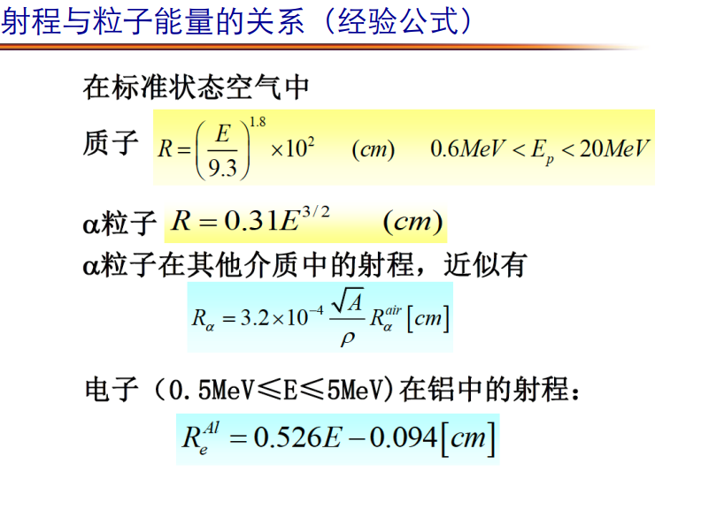

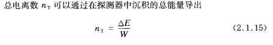


## 2.2 光子和物质的相互作用

和前面的章节不一样的是，光子没有电离

光子和物质作用后，要么波长变长（这就是另外一个光子了），要么作用后消失，所以光子没有射程的概念，并且这个相互作用是一个单次事件

光子和物质作用有三种形式，这三种都会产生次级电子，显然，通过探测这些次级电子**间接探测**光子会比较好

- 光电
- Compton scattering
- electro-pair

将*光子和物质的作用*与*电子和物质作用进行对比*

- 低能区域
  - 电子主要通过**电离**或**激发**损失能量
  - 光子通过 **光电**（这个多一些） / **Compton** 损失能量

- 中间能量
  - 电子**刹车辐射**
  - 光子通过**Compton**（这个多一些） / **电子对产生**
- 高能量
  - 他们两损失能量都和入射能量没关系了


### 光电

高中就学了，细节不写了

由于E-p守恒，一个自由电子没法吸收一个光子（没有$\gamma + e \rightarrow e^\prime$），**需要原子核接受反冲**（这个可以证明，但是我没时间了，所以留着），所以光电打出来的**光电子通常是最内层的那个电子**。80%的光电子来自K壳层

内层电子没了之后，原子处于激发态，此时退激发还会发射Xray

光电截面（K壳层的）

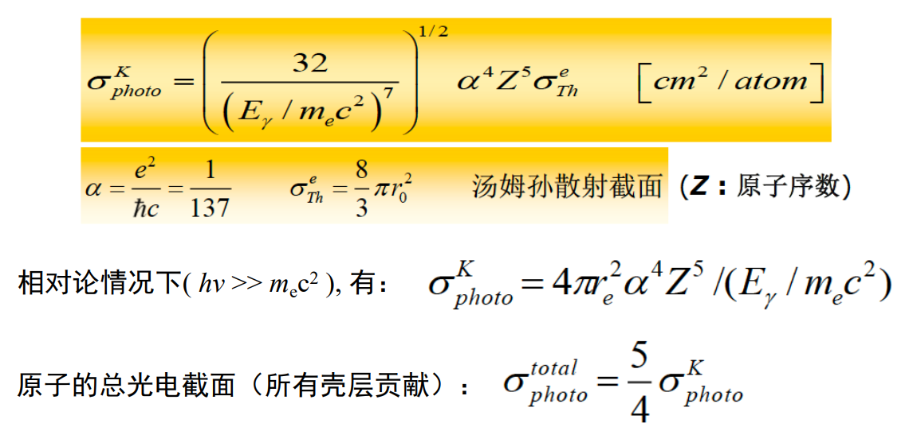

显然**光子能量越大，截面越小**，


$$
\sigma\propto Z^5
$$


所以通常选用高Z的材料探测光子/屏蔽Xray

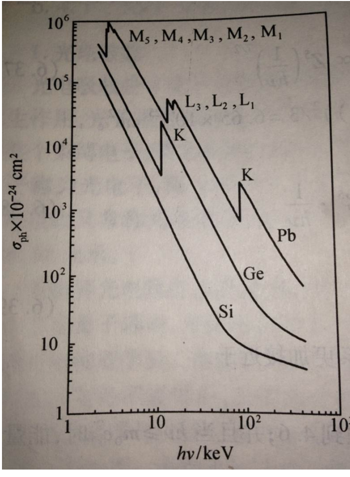

显然，图中的锯齿是由于光子能量没到壳层结合能导致的，具体的去看高中物理

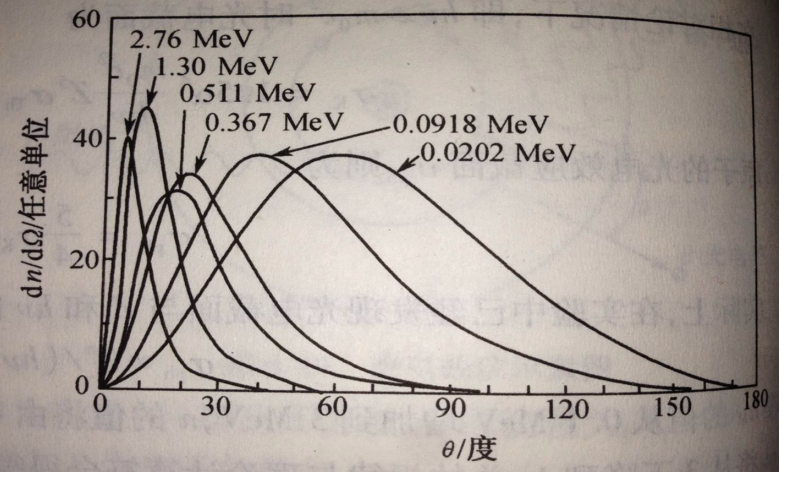

入射能量越高，光子越朝前面发射

### Compton scattering

显然，相比于上一节的光电喜欢和内层电子反应，这里Compton喜欢和最外层反应，然后由于最外层的电子结合能很小，所以通常把这个电子看成静止电子

以下公式我懒得推导了

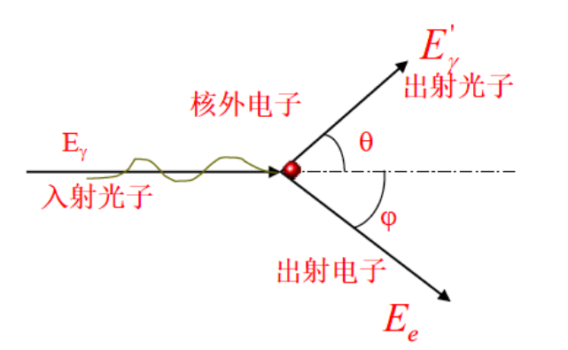

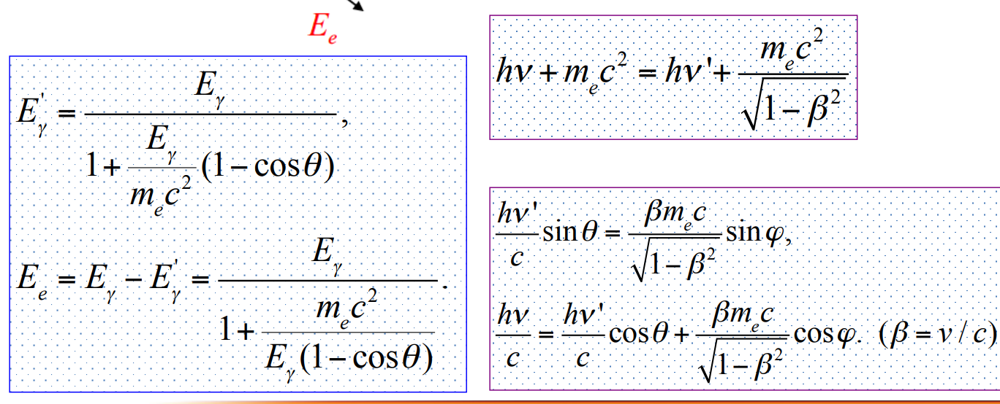

反冲电子只能朝前出射

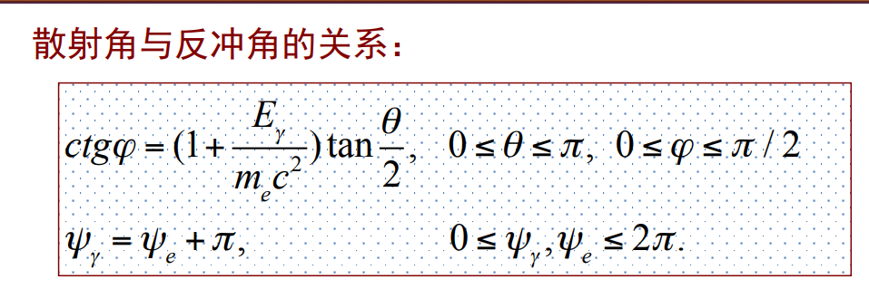

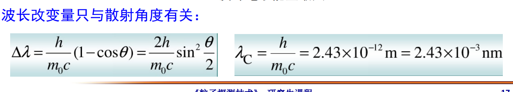

当$\theta = 0$时，电子能量等于0，光子和电子相当于无事发生

$\theta = 180\degree$，电子能量有max，散射光子沿着入射的方向的反方向出去，反冲电子沿着入射方向出去

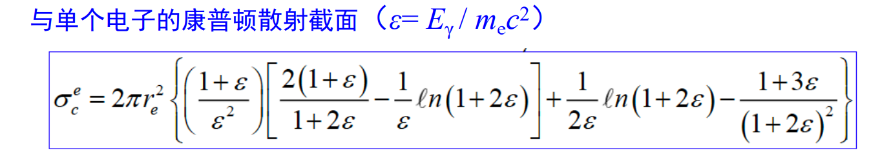

和整个原子的总截面就乘个Z即可

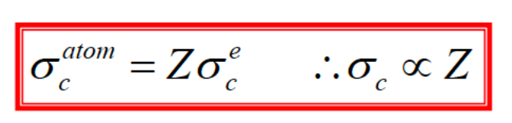

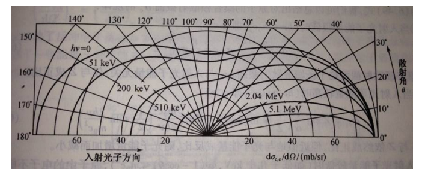

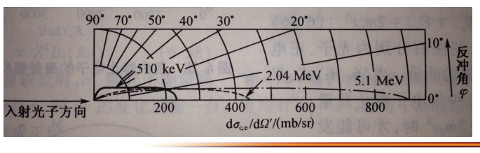

如图，能量越高，光子出射越前倾，电子也是，但是电子只有前向有分布，光子后向前向都有

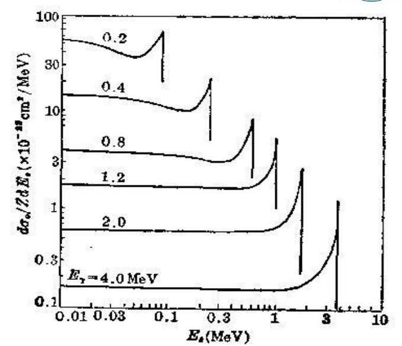

上图是入射光子能量一定，反冲电子能量分布，这个平的曲线叫Compton平台

### 电子对产生

在原子核库伦场的作用下，光子转化为正负电子对

**必须有外场作用才能产生正负电子对,也就是说这个库伦场的提供者也可以不是原子核，可以是电子的库伦场**


$$
E_{e^+} + E_{e^-} = E_{\gamma} - 2 m_e c ^2
$$


由于E-p守恒，原子核也要反冲（和光电是一样的），产生的电子对出射角度几乎都也是前向的

产生的负电子会电离损失辐射损失能量（详见第一节），正电子会慢化后和电子湮灭产生光子

当然，电子对产生也是有截止条件的


$$
\begin{align}
E_{\gamma} \ge 2m_ec^2 + 2 \frac{m_e^2}{m_{nucl}}c^2
\end{align}
$$


显然，第一项是电子的静止能量，第二项是核子的反冲。由于核子的质量显然远大于电子，所以第二项**只要不是电子提供的库伦场**，都可以忽略

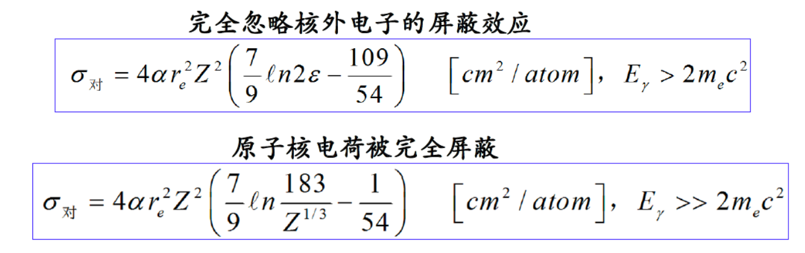

上图中，只需知道
$$
\sigma \propto Z^2
$$
即可


### *三种截面总结

$$
\sigma_{tot} = \sigma_{p-e} + \sigma_{Compton} + \sigma_{e-pair}
\\
\sigma_{p-e} \propto Z^5, \sigma_{Compton} \propto Z, \sigma_{e-pair} \propto Z^2
$$

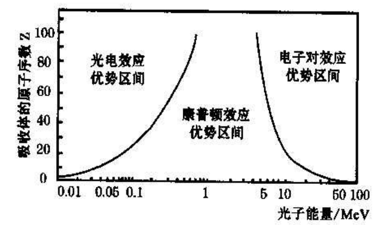

### 光子flux的衰减

这里的衰减指的是光子和其他物质作用然后波长变了或变成其他物质了，波长变了的光就不算做原光子了
$$
I = I_0 e^{-\mu x}
$$
上面的这个式子中**x不是质量厚度**，就是普通的距离，单位（$cm$），$\mu$是介质对光子的衰减系数，单位（$cm^{-1}$）

然后为了配合2.1中的那个质量厚度定义$t = \rho x, \mu^\prime = \mu / \rho$
$$
I = I_0 e^{-\mu^\prime t}
$$
显然，t现在有$g/cm^2$的量纲，$\mu^\prime$的单位$cm^2 / g$


## 2.3 强子和物质的强相互作用

分为弹性散射和非弹性散射

- 弹性散射：参与作用的粒子的**内部状态**没有变
- 非弹性散射：内部状态变了，通常有次级粒子产生

有一个误区就是认为非弹性散射一定是有次级粒子产生的，显然这个定义不是这么说的，但是平时用这个武断的判断方法貌似没出错过

**引入宏观截面**
$$
\Sigma = N * \sigma
$$

- $\sigma$是反应过程的截面（$cm^2$），

- N是单位体积的原子数（$cm^{-3}$）$N = N_A \cdot \rho / A$ （NA是1mol物质的粒子数量，A可以是核子数，也可以是g每mol）

显然，可以理解为单位体积内所有原子提供的截面大小，也就是物质在介质中穿行单位距离（$cm^{-1}$）发生相互作用的概率（因为$\Sigma$的单位是$cm^{-1}$）

**然后我们就可以定义平均自由程（相互作用长度）了**（*考研复试考的那道题，我记这个一辈子*）
$$
\lambda = \frac{1}{\Sigma}(cm)
$$
**平均发生一次相互作用所需要的距离**

所以
$$
\lambda = \frac{A}{N_A\rho\sigma}
$$
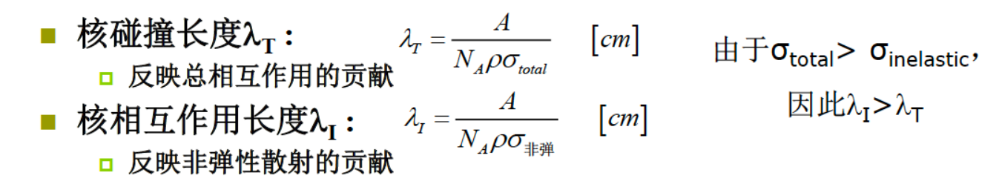

回忆一下**辐射能损**中的那个辐射长度（在刹车辐射那里引入的）

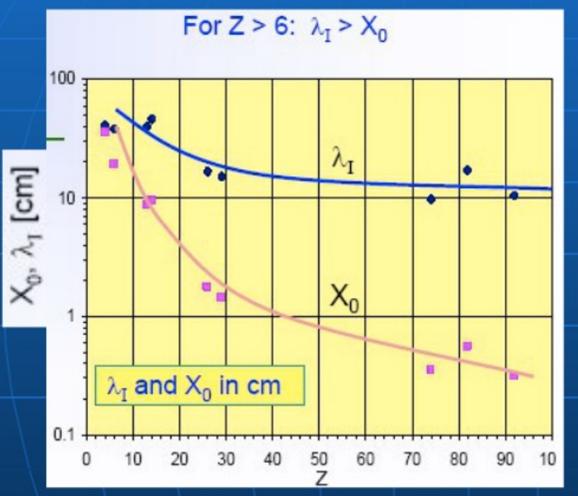

显然，只要Z不是很小，辐射长度都比相互作用长度短很多


### 中子探测

中子不带电，所以不用考虑电磁力了，主要是强相互作用。具体的大类如下

- **吸收**，中子被介质原子核吸收了，原子核被激发后退激时，发射gamma线 / 次级重的带电粒子
- **散射**，中子和原子核碰撞，出射中子能量方向变化，原子核受到反冲 / 激发

显然，可以通过探测这些次级带电粒子去探测中子

如果再细节一点

1. 弹性散射

2. 非弹性散射（这里指的是中子没有被吸收的那种）

3. 辐射俘获（原子核把中子吸收后处于激发态，退激发射gamma线）

4. 带电粒子发射（上面的过程把gamma线换成重的带电粒子）

5. 重核的裂变（原子弹那个）

1、3过程是最普遍的过程


因为中子不带电，而带电粒子好测量，所以需要一个叫**辐射体**的玩意和中子反应后产生带电粒子，然后探测带电粒子，

常用方法如下

- 核反冲法
- 核反应法
- 核裂变法
- 核活化法

## 2.4 高能粒子簇射效应

高能粒子和物质反应，产生次级粒子，次级粒子又产生次级粒子；分为以下两类

- 电磁簇射：高能电子 / gamma光子和物质通过电磁作用，产生电子，电子产生光子，光子产生电子……
- 强子簇射：高能强子和介质原子通过强作用，产生次级强子，次级强子又产生次级强子……


### 电磁簇射(shower)

正电子、电子、光子能量$\ge 1 GeV$就会有簇射

- 刹车辐射产生次级光子
- 产生次级e+e-对（详情见2.3）
- 上述两种过程的次级粒子再产生次级粒子

这个簇射中的粒子数量会一直增加，直到这个簇中的电子能量降到一个阈值Ec之下，之后簇的能量会通过电离和激发耗散掉（而不是继续产生粒子）

在上面章节我们定义了辐射长度（刹车辐射）$X_0$，代表一个电子能量由**刹车辐射能损**衰减到1 / e的时候行进的平均距离


**但是！**这里又有个辐射长度$X_0$。这个长度代表电子能量衰减到1 / e的时候行进的平均距离，**没有说是什么原因导致的电子能损，需要把这里的X0和刹车辐射的X0区分开**。这里的X0专指电磁shower的辐射长度

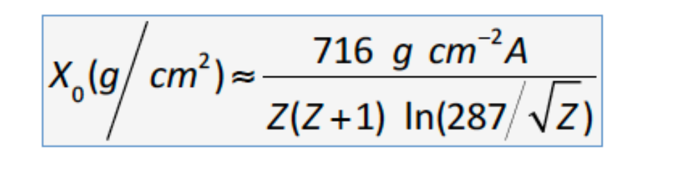

然后呢，光子强度衰减到$I_0$的1 / e时行进平均距离是$(9 / 7) X_0$（怎么来的？不知道，ppt直接给出来了）

上面我们提到了一个阈值Ec，在这个阈值之上shower粒子数一直增加，之下的话shower的能量会耗散，这个Ec就是**电离能损等于刹车辐射能损时的能量**（详情见2.1）

下图中，E是电子的能量，I是光强

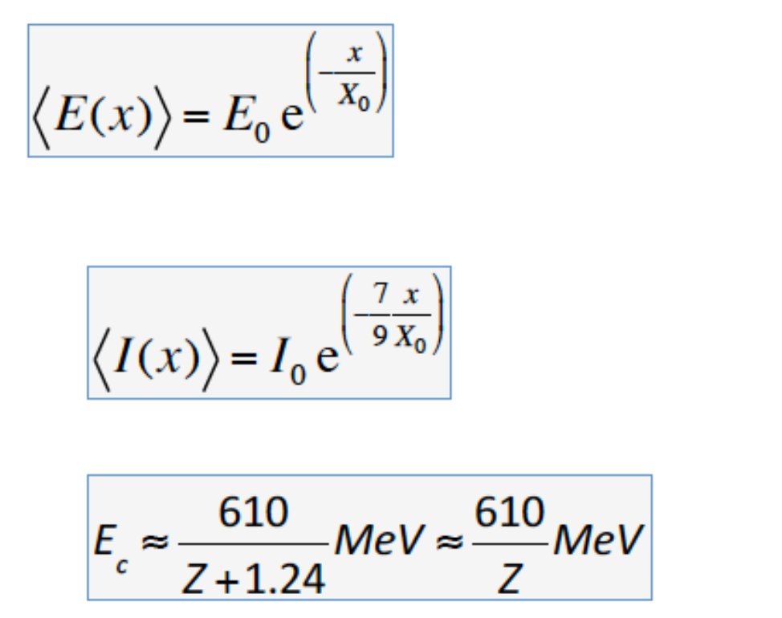

在通过k个辐射长度后，shower中的粒子数量$\sim 2^k$个（每通过一个辐射长度，一个粒子变成两个），平均每个粒子能量$E / 2^k$，当每个粒子能量$\le E_c$的时候粒子数目最大（原因看上面写了）


shower的平均长度
$$
t_{max} \approx \ln\frac{E_0}{E_c} + t_0 \ \ \ \ where \ t0 = \pm0.5 \ (photons \ get + \ and \ electron \ get \ -)
$$
对于一个量能器，若想**收集95%的shower**，那么它的长度
$$
t_{95\%} \approx t_{max} + 0.08Z + 9.6
$$
若一个量能器长度到了$25X_0$，那么对于300GeV的电子，泄**露的shower数量也不到1%**


另外，Z值也会对shower有影响

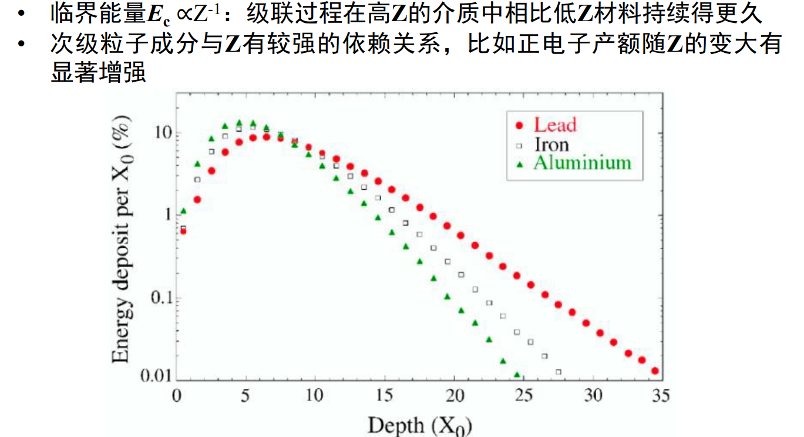

---

上面讲的是纵向的shower长度，下面是横向的shower半径

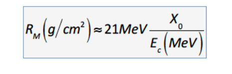

90%的shower能量都在这个半径之内，再宽一点的话，3Rm能包括99%的shower

若量能器要能精确测量shower的位置，则像素格子的大小至少要小于RM

Rm几乎不依赖于介质


### 强子shower

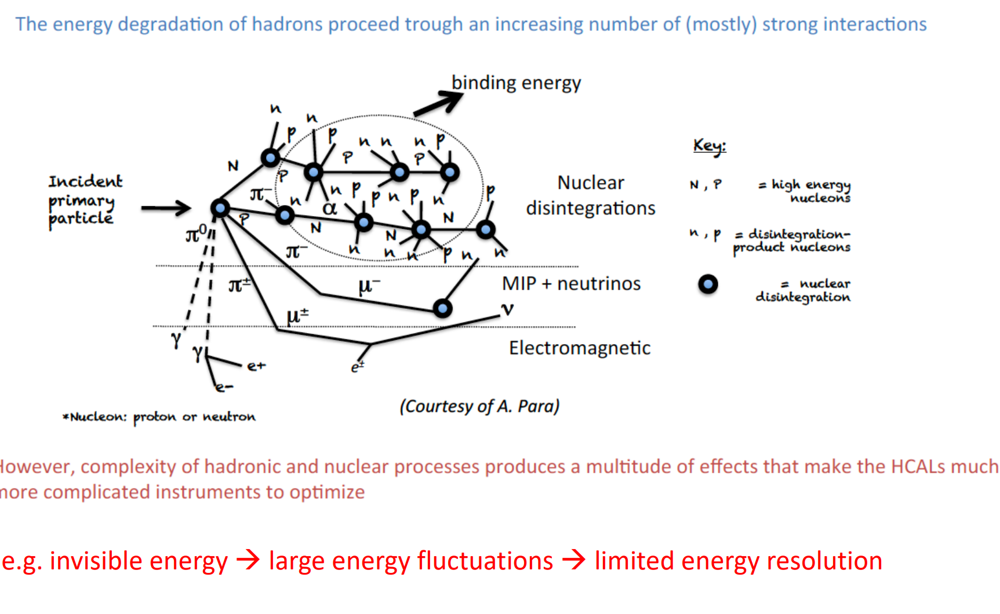

- 纵向长度：由核作用长度决定
- 横向：由次级粒子的横动量决定

在**电磁shower**里面，我们主要由X0决定**级联过程**，这里换成**核作用长度**就行

在衰变过程中的中微子、$\mu$子、部分中子看不见他们，不好探测

### 量能器

有两种

- 采样量能器，由两种材料交替而成，一种吸收粒子能量，一种产生可检测的信号
- 全同量能器，只使用一种材料，把上面的两种材料的两种功能全部实现

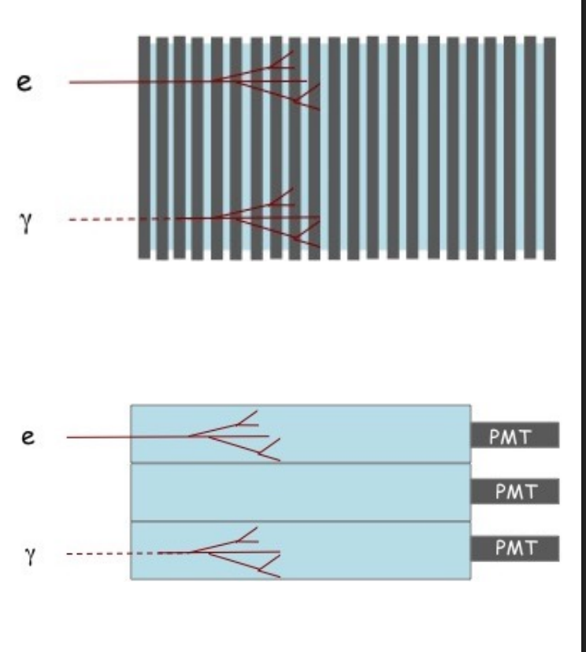

下图**很经典，诠释了几种粒子的探测方法**

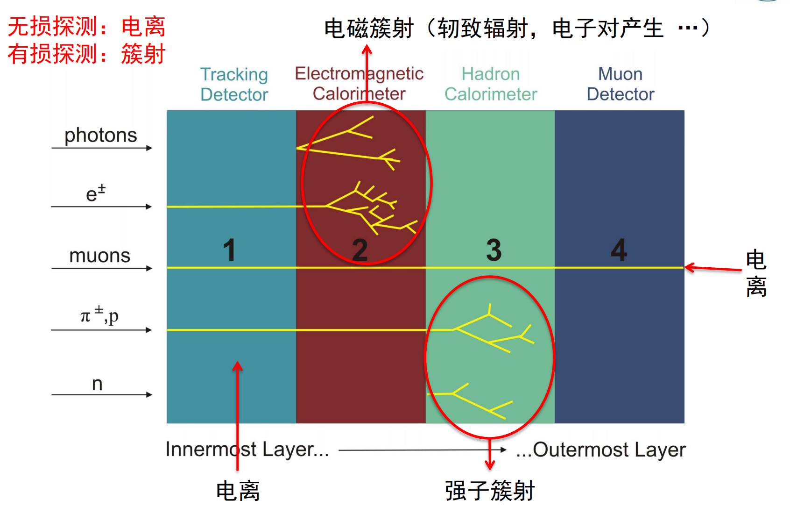
