> 章节用h1
>
> X.X用h2
>
> X.X.X用h3（或者老师ppt写的小标题）
>
> h4h5h6随便用

# 第四章

## 4.1 气体探测器基本原理

#### 特点

1. 对被测粒子影响小
2. 较快的时间响应（粒子穿过到探测器读出数据的时间短？），空间分辨率好
3. 探测器可以做的奇形怪状
4. 寿命比996打工人长
5. ***便宜***

#### 原理

入射粒子特别快地穿过探测器，期间与气体作用发生电离，把电离出来的粒子收集起来就可以知道粒子的运动信息（收集方法：电场）

### 气体电离

包括入射粒子直接产生的电离（**原初电离**）和产生的粒子再产生粒子（**次级粒子**）

能产生的电离的最小入射粒子能量

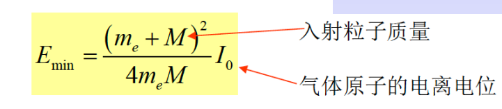

引入两个新的概念

**比电离**：单位长度上产生的电子-离子对数目

**平均电离能**：产生一对电子离子对所需要的平均能量

知道平均电离能，可以估算总电离，直接拿能损除以平均电离能，总电离数约等于等于3~4倍的原初电离

**气体电离能都差不多在30ev左右**如果是混合气体计算公式如下

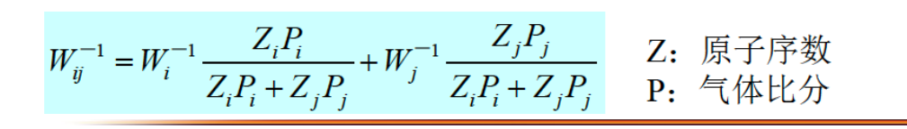

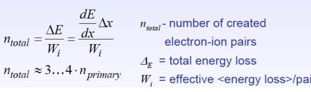

### 电子和离子在气体中的运动（外加电场）

扩散：密度大到密度小的区域

电子吸附：电子和中性原子吸附形成负离子

复合：电子和正离子复合形成中性原子

**漂移**：沿着电场方向做定向运动

前三种不利于我们收集电离电荷，以便探测粒子轨迹

### 漂移

不是开车那个漂移，单纯的粒子在电场作用下定向运动

#### 离子的漂移

离子因为质量大，容易在碰撞的时候损失能量，所以动能变化不大

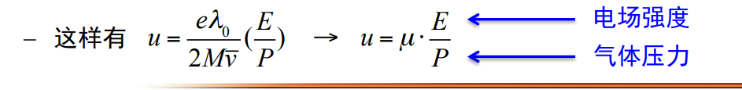

- u为平均定向运动速度，$\mu$定义为离子迁移率

- 对于所有的气体，离子迁移率在一个大范围之类和E/P无关（$E/P \le 3 \times 10^3 V\cdot cm^{-1} \cdot atm^{-1}$）
- 离子迁移速度的数量级为$10^3cm/s$典型时间为几百$\mu s$到几百ms，

#### 电子的漂移

质量小，很容易漂移

- 简单表达式

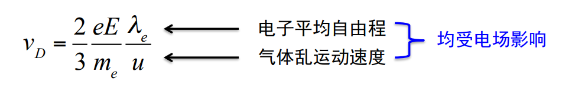

- 复杂表达式

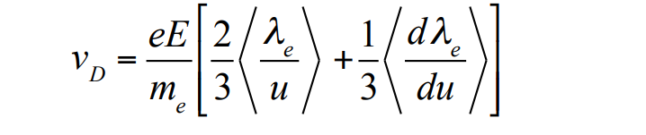

- 电子漂移速度数量级为$10^6 cm/s$典型时间$1\mu s$

- 有些气体在电场很大的时候电子速度增大达到饱和

> 存在外磁场并且外磁场不是平行于电场的时候，电子漂移会出现一个和电场的夹角，称为洛伦兹角
>
> 但是我们ALICE没有这个问题所以略过

### 电荷的收集和放大

这里我们考虑**外加电场的电压**和**收集到的离子数量**的关系

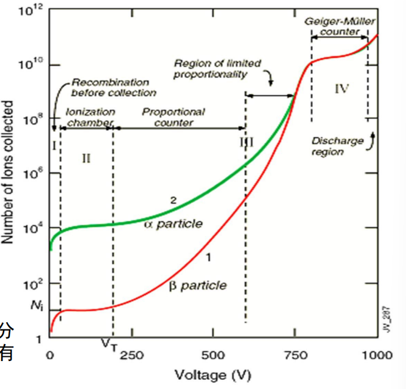

1. 区域1：复合区

   - 离子漂移速度小，电子吸附扩散复合很多

2. 区域2：饱和区

   - 吸附扩散复合影响减小，在这个区域内存在坪区，也就是当电压达到某一个阈值的时候，总电离数全部被收集达到饱和

3. 区域3：正比区&有限正比区

   - 由于电压的增加，电离出来的离子、电子可以产生次级电离了，次级电离粒子又会引起连锁反应，这样会引起**雪崩过程**。我们会收集到很多的粒子，该现象称为气体放大

   - define**气体放大倍数**$$M = \frac{N}{N_0}$$，也就是收集到的电荷数量除以*原来的总电离数目*（就是没有电压的时候收集到的离子数目，图线的截距）
   - 在这个区域的**后面一段**，由于正离子移动很慢，阻唉了电子的移动，减少了次级离子的增加，所以这一段称为**有限正比区**，这个效应称为**空间电荷效应**

4. 区域4：GM区
   - 在这个区域，由于空间电荷效应，收集到的粒子饱和了，且不同种类入射电子在这个区域收集到的总粒子都是一样的
5. 区域5：连续放电区
   - 气体被击穿了

## 4.2 三种典型气体探测器

> 显然这里的气体探测器结构原理差不多（差别不大，但是还是有差距的），但是电场强度差别很大，具体的差别可以从上面的图看出来，使用不同的电压可以实现不同的功能达到不同目的

### 电离室

**工作在饱和区**，上图的区域二

饱和区的特点可以看上面，扩散复合吸附的影响减小，并且没有气体放大，**这个时候收集的电荷总数就是原初电离**

由上图可以知道，输出信号和**入射粒子总类**有关

#### 信号产生原理

在电离室内部存在一个电荷的时候(假设为负电荷)，这个电荷会在**两个电极板**（正和负）上面感应正电荷，在电离室内部的电荷移动的时候，感应的电荷也会变化，引起外部回路的电流的变化

**所以只有在电荷漂移的过程之中回路中才有电流**

由于正离子的质量远大于电子，所以在前段时间，电子是脉冲的主要成分（**快成份**），后段时间是正离子的贡献（**慢成分**）

*具体公式看书去吧，我懒得抄了*

### 正比计数器

> 工作在正比区（上图的区域三）

在这个区域电子有足够的能量发生**雪崩放大**

**气体放大倍数M**$$N_T = M * N_0$$，表示**收集到的电荷总数和原初电离的比值**

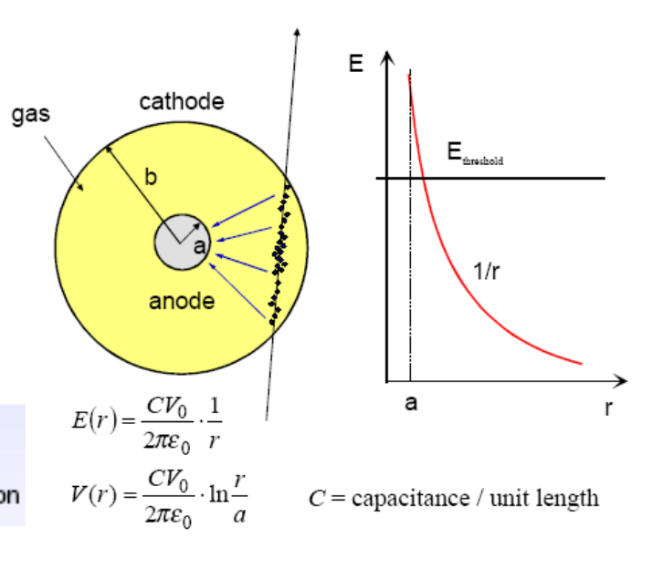

通常使用的正比计数器是**圆柱形**的，这就导致电场强度不是均匀的，所以在外围的电离电子**一开始不会雪崩**，在**离中心电极近**的地方才会雪崩，**由于这个原因，雪崩电子对信号的贡献很小**，主要贡献是阳离子向阴极移动

由上面的论证可以看出，这个东西的脉冲幅度和**原初电离位置没有关系**，因为需要电子跑到阳极附近才会发生雪崩，而在跑到阳极之前，没有雪崩，产生的脉冲很小，被忽略

### G-M计数器

工作在上述图像的第五个区域（最右边）（为什么不是第四个，你都叫GM区了，ppt是不是写错了（**是的**，ppt写错了，和课本有出入，课本写的第四区））这个区域会发生连续放电

显然在这个区域中，仪器灵敏度高，很容易探测，**缺点**就是不同粒子的脉冲都长一样，没法区分

## 4.3 气体多丝室

缩写MWPC

> 说简单一点，就是之前的气体探测器他们都只有一个阳极，信号都在这个阳极上产生，**没法分辨电离位置**，那我就多加几个阳极，不就可以通过判断哪个阳极吸收了电离的电子来确定位置吗

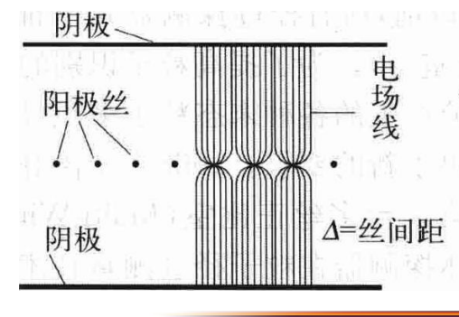

### 多丝正比室

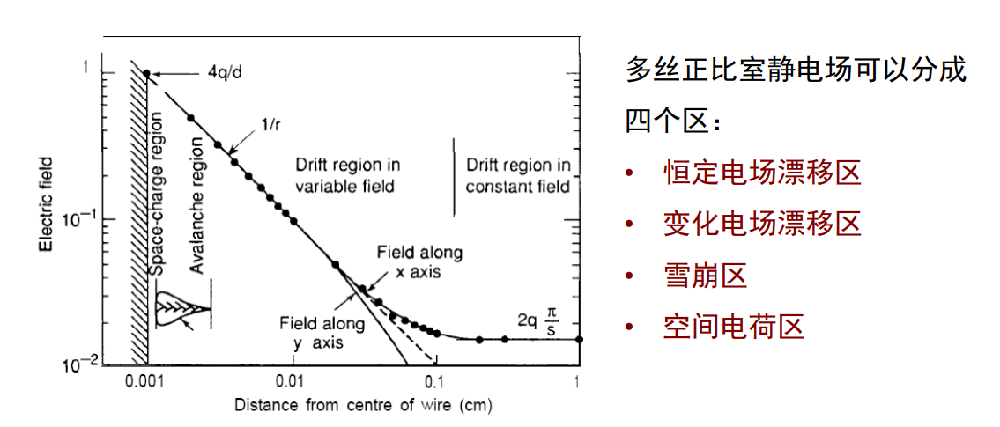

由上图，可以看到有四个区域（*从右往左看*）

### 多丝漂移室

由名字可以得出，这个探测器中，电子只有漂移没有雪崩

### 时间投影室

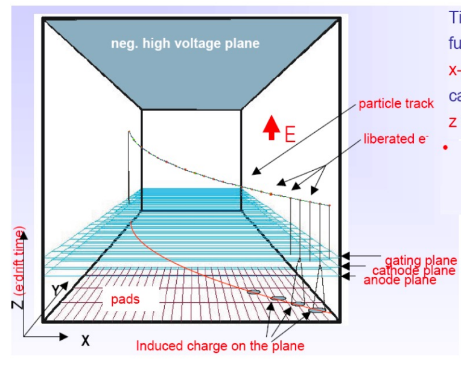

**上面漂移，下面雪崩**

通过漂移可以测量粒子的Z坐标，通过雪崩可以测量X和Y
