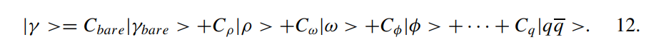

# 注意：若有LaTeX公式无法显示，就多刷新几次，实在不行就去我仓库下载后拿其他软件看

> 以下总结来自ai

---
## abstract

携带高电荷的离子运动时会产生强电磁场，其作用等效于光子束流。在大碰撞参数条件下，强子相互作用无法发生，此时离子通过光子-离子和光子-光子碰撞（称为超周边碰撞，UPCs）进行相互作用。相对论性重离子对撞机（RHIC）、Tevatron对撞机以及大型强子对撞机（LHC）等强子对撞机能够以远超其他设备的亮度与能量实现光核作用和双光子作用；LHC将达到的[\gamma p]作用能量是强子-电子环形加速器（HERA）的十倍。目前已开展的研究涵盖反氢产生、[\rho^0]介子的光致生成、铅向铋的嬗变、集体核共振激发等多样化反应。在LHC上，通过UPCs可以研究多种新型物理过程。

# Physics of Ultra-Peripheral Nuclear Collisions (UPCs)

## 1. **Fundamental Concepts**
   - **Definition**: Large-impact-parameter collisions $b > 2R_A$
   - **Key Mechanisms**:
     - **Photon-Nucleus Interaction** (Fig 1a)
     - **Photon-Photon Interaction** (Fig 1b)
   - **Key Players**:
     - Relativistic heavy ions (RHIC, LHC)
     - Equivalent photon flux (Weizsäcker-Williams method)

---

## 2. **Photon Flux & Energy**
   - **Critical Formula**:
     - $$ N(\omega, b) = \frac{Z^2 \alpha \omega^2}{\pi^2 \gamma^2 \beta^2 c^2} \left[ K_1^2(x) + \frac{1}{\gamma^2} K_0^2(x) \right] $$
   - **Key Features**:
     - Transverse polarization dominance (γ ≫ 1)
     - Energy cutoff: 
       - $$ \omega_{\text{max}} \sim \frac{\gamma \hbar c}{b} $$
   - **Impact Parameter Dependence**:
     - Coherent interactions: 
       - $$ b > 2R_A $$

---

## 3. **Key Reactions & Observations**
   - **Photonuclear Reactions**:
     - **Nuclear Excitation**:
       - GDR/DGDR (Fig 3b)
       - Astrophysical reactions (e.g., ⁷Be(p,γ)⁸B via Coulomb dissociation)
     - **Particle Production**:
       - Vector mesons (ρ⁰, J/ψ: STAR@RHIC, Table 2)
       - Heavy quark pairs (cc, bb: LHC predictions, Table 3)
   - **Two-Photon Processes**:
     - $e^+e^-$ pairs (QED tests, Fig 8a)
     - Meson pairs (π⁰, η: LHC predictions, Table 4)
     - Antihydrogen production (LEAR/Tevatron)

---

## 4. **Experimental Signatures**
   - **Coherent Signals**:
     - Low transverse momentum ($p_T < \hbar/R_A$)
     - Rapidity gaps (non-hadronic background rejection)
   - **Interference Effects**:
     - Vector meson production symmetry (Au+Au vs p+p)
     - EPR-like wavefunction preservation (STAR data, Fig 6)

---

## 5. **LHC's Unique Potential**
   - **Energy Frontiers**:
     - γp energy ~10× HERA
     - γγ energy ~TeV scale
   - **New Physics Probes**:
     - Higgs via $\gamma\gamma \rightarrow H$ (MSSM-enhanced)
     - SUSY pairs (e.g., $\tilde{e}^+\tilde{e}^-$)
     - Graviton production (extra dimensions)

---

## 6. **Challenges & Strategies**
   - **Background Suppression**:
     - Triggering on forward neutrons (Coulomb excitation tagging)
     - Total event $p_T$ filtering (Fig 9)
   - **Theoretical Tools**:
     - Glauber model (coherent cross sections)
     - QCD predictions (vector meson forward amplitudes)

---

## 7. **Future Directions**
   - **Nuclear Gluon PDFs**:
     - J/ψ, ϒ photoproduction as probes
   - **Quantum Optics Analogies**:
     - Bose enhancement in multi-ρ⁰ production
   - **Machine Implications**:
     - Beam loss from $e^+e^-$ capture (LHC Pb-Pb limitations)

1924年，时年23岁的恩里科·费米向《物理学期刊》提交了一篇题为《论原子与弹性带电粒子间碰撞理论》的论文（文献1）。这篇论文并未收录于他的《著作集》，但据称这是费米最钟爱的理论思想之一，并在其后期科研生涯中频繁运用（文献2）。在该论文中，费米提出了一种被称为"等效光子方法"（或称"虚光子方法"）的理论框架，将带电粒子的电磁场视为虚光子流进行处理。十年后，外斯塞克（Weizsäcker）和威廉斯（Williams）将这一方法拓展至超相对论粒子领域，该理论体系现多被称为外斯塞克-威廉斯方法（文献3）。

高速运动的带电粒子会产生径向发散的电场和环绕粒子的环形磁场。在远离粒子运动轨迹的某点观测，其电磁场特性与真实光子场具有相似性。基于此，费米提出用等效光子流替代高速粒子的电磁场。通过时变电磁场的傅里叶变换，可推导出能量为ω的光子数目n(ω)的分布规律。这种虚光子方法在量子电动力学（QED）中被广泛应用于描述原子电离或带电粒子引发的核激发等过程。

当两核发生碰撞时，可能产生两类电磁相互作用过程：一是单个离子发出的光子与另一核发生作用（如图1a所示）；二是两核发出的光子发生双光子碰撞（如图1b所示）。超周边强子-强子碰撞为研究电磁过程提供了独特平台。在大型强子对撞机（LHC）中，光子-质子碰撞的中心质心能量将比现有加速器高出一个数量级，而光子-重离子碰撞能量可达固定靶加速器的30倍。重离子产生的强电磁场使得多光子激发过程的研究成为可能。

超相对论重离子相互作用已被用于研究核光激发（如巨偶极共振）和强子光致产生。库仑激发作为低能核物理的传统研究手段，在重离子产生的强电磁场作用下，可实现对核靶的多光子激发，从而产生核的高激发态（如双巨共振）。单离子对间的多重独立相互作用也成为可能，例如通过多重矢量介子产生过程开展极化光子研究。高能光子还可用于研究重核在低费曼x值区域的胶子密度。

双光子过程不仅是检验QED的重要工具，在强场条件下的原子物理过程研究中也发挥关键作用。欧洲核子研究中心（CERN）的低能反质子环（LEAR）和费米实验室的Tevatron对撞机已成功实现反氢原子制备（文献7,8）。在最高能对撞机上，γγ→X类反应可用于探测介子共振态的夸克组成与自旋结构，介子或重子对产生过程则为强子内部结构研究提供新途径。LHC上的双光子过程还可研究γγ→W+W-等电弱相互作用过程（文献9）。

费米方法的应用已超越QED范畴，被拓展至核间相互作用的强相互作用领域。基于π介子交换的等效π介子方法，成功描述了核-核碰撞中的阈下π介子产生过程（文献10）。费什巴赫（Feshbach）提出的"核外斯塞克-威廉斯方法"，系统阐释了重离子周边碰撞中核相互作用引发的激发过程（文献11）。最新进展显示，非阿贝尔外斯塞克-威廉斯场可描述核碰撞中的增强胶子分布函数（文献12）。

自费米开创性工作以来，随着劳伦斯伯克利国家实验室（LBNL）贝瓦拉克（Bevalac）等相对论重离子加速器的问世，该领域取得长足发展。美国密歇根州立大学国家超导回旋加速器实验室（NSCL/MSU）、法国大型重离子加速器（GANIL）、日本理化学研究所（RIKEN）、德国重离子研究中心（GSI）等装置在核集体激发、电磁碎裂过程及天体核反应（如太阳、超新星和宇宙大爆炸相关反应）研究方面取得丰硕成果。布鲁克海文国家实验室的相对论重离子对撞机（RHIC）已启动高能过程实验研究。未来数年，CERN的LHC将投入运行，为重介子研究、核胶子分布测量及新物理探索提供革命性平台。

本文综述了该领域的实验进展、理论诠释及未来前景。关于超周边核碰撞（UPCs）的既往综述可参阅文献（9,13-16）。

我们系统阐述了研究强子对撞机中光致产生与双光子反应的理论框架，并探讨了这些技术在多领域的重要应用。虽然低能核物理领域长期运用此类方法并取得丰硕成果，但直到近年随着RHIC和Tevatron等高能装置的启用，才真正开启强场环境下粒子产生过程的研究。

尽管当前超周边核碰撞（UPCs）的实验数据仍显匮乏，但过去十年该领域已取得跨越式发展，理论体系日臻完善。RHIC的新实验数据正推动理论界聚焦最易观测的物理通道。随着RHIC成果的持续产出及LHC的即将运行，UPCs研究即将在多个物理领域实现突破性贡献。

LHC将实现光子-核相互作用能量达到HERA等加速器的十倍量级，这为探索新物理过程（部分过程无法通过强子碰撞实现）、测量极低费曼x值区域的胶子密度及开展系列创新测量开辟广阔前景。同时，UPC反应对装置运行至关重要——电子对产生伴随电子俘获过程将制约LHC重离子碰撞的亮度极限。

---

> 以上来自ai

> 以下来自自己

---

# introduction
这里主要讲的费米发明的虚光子方法，一个高速移动的离子会产生电磁场，这个电磁场在某些地方就像一个真实的光子一样，于是拿光子replace这个电磁场

能量为$\omega$的光子的数目$n(\omega)$由**含时电磁场fourier变幻**给出

QED中的虚光子方法可以简单地用这个方法描述（意思是QED中的虚光子更复杂？）

两个核子碰撞的时候，有**两种电磁过程**，一个是只有一个核子发射光子，一个是两个核子都发射光子，然后光子相撞击，*这里应该指的虚光子，实光子可以吗？我觉得可以吧？*

本文研究的是超外围碰撞，比擦边碰撞还歪（边都擦不到），用于研究*电磁过程*，由于重离子电磁场很强，所以要考虑多光子过程（可以理解为电磁场越强，需要更多虚光子去模拟这个强电磁场？）

高能量光子能用于研究低Feynman-x的重离子的**胶子分布**（这个费米x是指的什么？应该指的是部分子的动量分数）

光子散射（photoproduction）截面（就是两个核子碰撞会产生光子，这个光子的分布）
$$
\begin{align}
\sigma_X &= \int d\omega \frac{n(\omega)}{\omega} \sigma_X^{\gamma}(\omega)
\end{align}
$$

其中$\sigma_X^{\gamma}$是光核截面（photonuclear）（这个光核截面是啥尚不清楚，猜测是一个核子发射的光子和另外一个核子碰撞的截面？）

$\gamma \gamma \rightarrow X$这种过程可以用来探测*夸克结构或介子共振的自旋结构*，介子对、重子对的产生也可以探测强子的内部结构，在LHC这里会有$\gamma \gamma \rightarrow W^+ W^-$过程

双光子过程的截面
$$
\begin{align}
  \sigma_X = \int d\omega_1 d\omega_2 \frac{n(\omega_1)}{\omega_1}
  \frac{n(\omega_2)}{\omega_2}
  \sigma_X^{\gamma \gamma}(\omega_1 \omega_2) 
\end{align}
$$

其中$\sigma_X^{\gamma \gamma}(\omega_1 \omega_2)$是双光子截面，这玩意和公式（1）长的很像，（**这个地方由于翻译问题，还需要确定一下它说的是哪个过程，看看后面的文章有没有讲清楚？**）

## 1.1 虚光子流
众所周知，一个相对论粒子的电磁场会收缩，收缩成一个pancake，光子的能谱取决于目标和电荷的最小距离以及抛射体的速度
（这个目标和电荷各指的啥？我猜这个最小距离是碰撞参数b, 怎么感觉他说的是打靶）

在碰撞参数b下，相互作用时间是 $\Delta t \widetilde{\ \ \ \ } b / (\gamma v)$, 在实验室系，最大光子能量
$$
\begin{align}
\omega^{max} &= \frac{\hbar}{\Delta t} \ \widetilde{\ \ \ }\ \frac{\gamma \hbar v}{b} 
\end{align}
$$

下面这个公式我没弄懂

$$
\begin{align}
\gamma &= 2 \gamma^2_{collider} - 1
\end{align}
$$

对于擦边碰撞，$b = 2R_A$，由公式（3），最大光子能量对于核子的能量是
$$
\begin{align}
\frac{\hbar}{2R_A Am c}
\end{align}
$$

这里稍微计算可以发现作者使用了以下近似，很奇怪
$$
\begin{align}
  \frac{\gamma v}{c} & \approx 1 \\
  \beta^2 & \approx \frac{1}{2}
\end{align}
$$

对于重离子，$R_A \approx 7 fm$，对于质子，$R_A$没有定义（？？？），重离子中，光子对于核子的能量比值为$0.03 / A$（这个A的意义不明，怀疑作者写错了）
，质子的光子的能量比值取$10\%$

单位面积的虚光子流强
$$
\begin{align}
  N(\omega, b) = \frac{Z^2 \alpha \omega^2}{\pi^2 \gamma^2 \hbar^2 \beta^2 c^2}(K^2_1(x) + \frac{1}{\gamma^2}K^2_0(x))
\end{align}
$$

其中总虚光子流强,(显然就是把N对所有可能的碰撞参数积分)
$$
\begin{align}
  n(\omega) = \int N(\omega, b) d^2 b
\end{align}
$$

Z指的是离子的电荷量，$x = \frac{\omega b }{\gamma \beta \hbar c}$，两个K是修正杯赛耳函数
K1描述虚光子的横向极化，K0描述纵向极化，对于超相对论粒子主要是横向极化占大头

当$\omega > \gamma v \hbar / b$的时候，光子通量指数型减少，因为前面说的光子的最大能量是这个（公式（3））

这些$-q^2 < (\hbar / R_A)^2$的光子几乎像真的一样(除了在产生e+e-对的时候)，这个量被叫做虚拟度，有动量平方的量纲

在这篇文章中认为碰撞参数大的（>2RA）才是有用的过程，而这个条件会将核子看作*硬球*，这对于重核子很准确但是对于轻核子不行

在光核反应中，想要得到有用的那一部分光子流，可以把$N(\omega, b)$对碰撞参数大于RA的部分积分，也就是上面两公式

结果如下

$$
n(\omega) = \frac{2Z^2 \alpha}{\pi \beta^2} [\xi K_0(\xi)K_1(\xi) - \frac{\xi^2}{2}(K^2_1(\xi) - K^2_0(\xi))]
$$
这个公式很显然没有包含方向，但是由对称性知，标量粒子（$J^{\pi} = 0^+$）由电场平行的产生，赝标量（$0^-$）粒子由电场垂直的产生（这里指的是离子的电场吧）

如果你用上面这个式子计算双光子过程的$n(\omega 1)n(\omega 2)$，结果会偏大，粒子质量越大，偏差越大

上面的方程只适合电偶极子激发

对于**质子**，不能使用硬球近视，为了解决这个问题便使用形状因子，对于**电偶极的形状因子**，

$$
\begin{align}
n(\omega) &= \frac{\alpha}{2 \pi z} [1 + (1 - z)^2] (\ln{\chi} - \frac{11}{6} + \frac{3}{\chi}- \frac{3}{2\chi^2} + \frac{1}{3\chi^3})

\\
\chi &= 1 + \frac{0.71{GeV}^2}{Q_{min}^2 c^2}
\\
z &= \frac{W^2}{s}
\end{align}
$$

其中W是光子和质子的质心系能量，Qmin是可能最小存在的4动量转移而s是在离子质心系中平均每个核子的质心系能量平方（为什么要平均到每个核子？而且是先做平均还是先求平方？我倾向于是质心系能平方对于每个核子的平均）

对于质子和轻的核子，由于电弱作用，还有些复杂的地方，动量转移太小了导致碰撞参数不太好观测（不确定性原理），这个不会影响总的光子流强，但是可能会影响它的某个组分（没有强子相互作用的那一部分）

当质子是完整的时候，上面这个式子是正确的，当光子能量很大（z趋近于1，而z是光子质子质心系能量除以离子质心系能量），磁场形状因子也很重要

## 1.2 实验特征 （回头看一下）

UPC末态状态很少，事件可以完全重建，pT都很小，这个信号很好测量

这一章可以略过把

# 2.低能下的光核反应 （抽时间回头看看）

相对论库伦激发（RCE）是一个很好的研究核子结构的工具，核诱导过程也可以使用

RCE包含单光子和多光子过程，前者可以使用微扰理论，RCE可以去探测生命短不稳定的核子

文章接下来扯到的辐射捕获过程怎么跑到天体物理去了，先放一边

巨偶极共振GDR发生在10-20MeV的原子核中，而双巨偶极共振（DGDR）则是在一个原子核内的两个巨偶极共振叠加，能量一般是两倍

DGDR只占UPC中RCE的总破碎截面的10%，主要贡献是GDR，然后通过中子发射衰变，这也是对撞机中束流衰减的一个主要来源

# 3.强子对撞机下的光生截面

强子对撞机有可能直接去确定核子中胶子分布。重矢量介子的排他性产生、重夸克反夸克对的光生截面和jet的光生截面可以用于探测胶子的分布。在DIS中没法探测胶子分布，因为胶子不参与电弱作用

核子中的胶子密度的一级近似可以写作如下

$$
G^A(x, Q^2) = Ag(x, Q^2)
$$

> nuclear是原子核，nucleon是核子（质子中子），前者大于后者

G是原子核的胶子密度，g是核子（质子中子这些）的胶子分布，A是核子数量（包括质子和中子），x是胶子的4动量分数（粒子物理学的那个），Q是4动量转移

对于电子的DIS结果表明，结构函数$F_2(x_2, Q^2)$存在偏差，x不同偏差也不一样，当前对核子中胶子分布的修正由F2的Q^2估计和衍射相互作用给出，而重离子对撞的光生截面也许可以为GA的测量提供更准确的测量手段

## 3.1 排他性粒子产生

排他性粒子产生的定义是反应之前的粒子还在$A + A \rightarrow A + A + V$，然后这里研究的是矢量介子，

在pp和AuAu对撞中，总的矢量介子截面可以用最上面的那个光生截面公式，把其中的$\omega$换成y（产生的矢量介子的快度），

$$
\frac{d\sigma}{dy} = n(\omega)\sigma_{\gamma A \rightarrow VA}(\omega)
$$

这个式子中光子能量和快度的关系为$\omega = (M_V c^2 / 2)\exp(y)$，Mv是矢量介子的质量，若光子流强知道了，则上面这个式子可以用于直接测量给定能量下的矢量介子光生截面

这个光子强子截面大部分可以被解释为：光子首先波动到qqbar对，这个qqbar会和目标发生强相互作用。然后呢光子是$J^{PC} = 1^{--}$的，所以它喜欢波动到矢量介子，波动进行的时间由不确定性原理阐述

$$
\Delta t \approx \frac{\hbar}{\sqrt{M_V^2c^4 + Q^2c^2}} \approx \frac{\hbar}{M_Vc^2}
$$

其中Q是光子的虚拟度（*就不能不要重复用同一个字母吗，又是虚拟度又是4动量转移的*），后面的近似在强子对撞机上很适合，因为光子的虚拟度很低

光子的波函数可以用fock表象展开

Cbare约等于1，其他的系数数量级上等于1 / sqrt137，我的理解就是光子可以通过电磁作用变成qqbar，所以写成上面这个样子，然后这个系数可以写为$C_V = \frac{\sqrt{4\pi \alpha_{em}}}{f_V}$，分母的系数由矢量介子衰变到轻子对的衰变宽度决定（虽然这里说轻子对，但是论文上只写了衰变到电子对的）

跟据*广义矢量介子优势模型（GVMD）*，$\gamma + A\rightarrow B$的散射振幅是把所有矢量介子散射振幅（加权）求和

$$
A_{\gamma + A \rightarrow B} (s, t) = \sum_V C_VA_{V+A \rightarrow B}(s, t)
$$

我的理解是，光子和A反应，而光子又会波动到矢量介子，然后上面也说了光子会先波动到矢量介子再和目标反应，所以是对矢量介子和A反应的振幅求和

对于弹性散射$\gamma + A \rightarrow V+A$，交叉项$V^\prime + A \rightarrow V + A$通常被忽略（意思是光子先波动到Vprime，在和A反应生成V和A），散射截面如下

$$
\frac{d\sigma(\gamma + A \rightarrow V + A)}{dt} = C_V^2 \frac{d\sigma(V + A\rightarrow V + A)}{dt}
$$

意思是*光子和A作用生成V和A*的截面是*光子先变成V再和A反应生成V和A*的CV2倍，这里**t是Mandelstam变量，不是时间，真想亲切问候作者，变量名称乱用**

还有一个表达式$\frac{d\sigma}{dt} = \abs{A}^2$，散射截面和散射振幅的关系

对于这个弹性散射，动量转移由强子形状因子决定

$$
\frac{d\sigma}{dt} =\left. \frac{d\sigma}{dt} \right|_{t = 0} \abs{F(t)}^2
$$

---

> 以上来自自己