# 第一章 随机变量

### 累积分布函数

观测值小于等于x的概率

---

$$
\begin{align}
	F(x) &= \sum_{xi \le x} P(x_i) & \text{离散}
	\\
	F(x) &= \int_{-\infin}^x f(x\prime)dx\prime & \text{连续}
\end{align}
$$

---

### 分位数

使$F(x) = \alpha$的x，或者说$x = F^{-1}(\alpha)$

### 联合概率密度分布函数

---

$$
\iiint f(x, y) dx dy = 1
$$

---

$$
f_x(x) = \int f(x, y) dy = \int g(x | y)f_y(y) dy
$$

---

上面这个函数称为边缘概率密度函数，显然这个函数在有两个变量的情况下只考虑一个变量

重要公式（1.32）a(x)为x的函数，x的分布知道，为f(x)，求a的分布g(a)

---

$$
g(a) = f(x(a))\left|\frac{dx}{da}\right|
$$

---

> 备注：如果函数不是单调函数，那么需要把所有反函数x(a)带进去，求完后加起来
>
> 下面这个公式是对他的推广

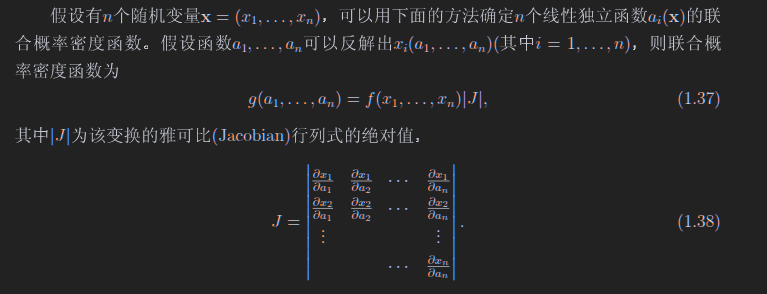

1.35梅林卷集，只适用于z=xy的情况求z的概率密度函数

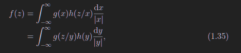

下面只适用于z=x+y

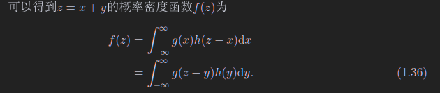

### 方差、协方差、关联系数

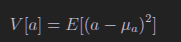

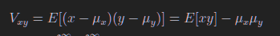

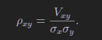

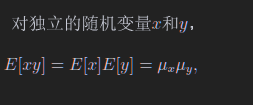

## 1.6 误差传递

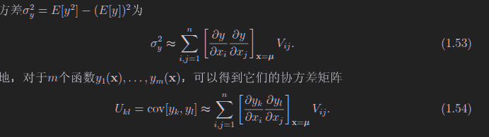

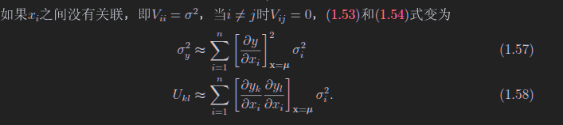

# 第二章 常用分布

## 2.1 二项/多项分布

要么成功，要么失败

N次试验中成功n次概率、期待值、方差

---

$$
\begin{align}
	f(n; N, p) &= \mathrm{C}^n_{N} p^n (1-p)^{N-n}
	\\
	E[n] &= Np
	\\
	V[n] &= Np(1 - p)
\end{align}
$$

---

多项分布，每一次实验的结果不止两个，每一个结果对应一个p，显然

---

$$
\sum_i p_i = 1
$$

---

若有N次实验，每一次试验产生一个结果，试验完成后，第一个可能结果有n1次出现，第二个有n2个，显然

---

$$
\begin{align}
	\sum_i n_i &= N
	\\
	f(n_1, ..., n_m; N; p_1, ..., p_m) &= \frac{N!}{n_1!n_2!...n_m!}p_1^{n_1}...p_m^{n_m} 
\end{align}
$$

---

如果这样思考：第i个事件发生了即为成功，没有发生（发生了其他的事件）则为失败，这不就是个二项分布吗，所以第i个事件的期望和方差同上面的二项分布

## 2.2 泊松分布

在二项分布的极限情况，即N很大p很小，Np为一个有限值，二项分布近似为泊松分布

---

$$
\begin{align}
	f(n;\nu) &= \frac{\nu^n}{n!} e^{-\nu}
	\\
	E[n] &= \nu
	\\
	V[n] &= \nu
\end{align}
$$

---

**若$\nu$很大，则泊松分布可以近似为高斯分布**

## 2.3 均匀分布

---

$$
\begin{align}
	f(x; \alpha, \beta) &= \begin{cases} \frac{1}{\beta - \alpha} & \alpha \le x \le \beta 
	\\ 0 & otherwise
	\end{cases}
	
	\\
	E[x] &= \frac{1}{2} (\alpha + \beta)
    \\
    V[x] &= \frac{1}{12} (\beta - \alpha)^2
\end{align}
$$

---

## 2.4 指数分布

---

$$
\begin{align}
	f(x; \alpha, \beta) &= \frac{1}{\xi}e^{-x / \xi}
	\\
	E[x] &= \xi
	\\
	V[x] &= \xi^2
\end{align}
$$

---

## 2.5 高斯分布

---

$$
\begin{align}
	f(x; \mu, \sigma^2) &= \frac{1}{\sqrt{2 \pi \sigma^2}}\exp(-\frac{(x - \mu)^2}{2 \sigma^2})
	\\
	E[x] &= \mu
	\\
	V[x] &= \sigma^2
\end{align}
$$

---

一个小定理:

---

$$
y \sim N(\mu, \sigma^2)
\Rightarrow
x = \frac{y - \mu}{\sigma} \sim N(0, 1)
$$

---

### 中心极限定理

如果n个**独立连续**随机变量，$\mu_i, \sigma^2_i$，**没有说他们是什么分布**，他们的和满足$\mu = \sum_i \mu_i, \sigma^2 = \sum_i \sigma^2_i$的高斯分布。

## 2.6 卡方分布

函数形式不想写

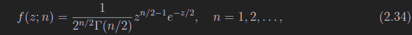

---

$$
\begin{align}
	E[z] &= n
	\\
	V[z] &= 2n
\end{align}
$$

---

上面的n是自由度，若$x_i \sim N(0, 1)$，则$\sum_ix_i^2$满足自由度为N的卡方分布。所以拟合的卡方每自由度最好是1

# 第三章 蒙卡方法

## 3.2 变量变换法

想要用f(x)抽样x，

1. 求f(x)的累积分布
2. 求累积分布的逆函数
3. 把均匀分布带入逆函数，即可

# 第四章 统计检验

## 4.1 假设、检验统计量、显著水平和效力

统计检验目的：看看观测的数据和预期的假设对不对的上

- 零假设：考察中的假设
- 备选假设：和零假设比较的
- 简单假设：在这个假设下，概率密度函数可以直接被完全确定
- 复杂假设：在这个假设下确定的概率密度函数有个可以变动的参数

- 检验统计量，完全可以用原始数据来当作检验统计量，但是维度太高了，所以换一个简单的
  - 可以这么理解$t = t(\vec x)$
  - 这也是个统计量，**从x算出来的或者测出来的**，你不用管这个啰嗦奇葩的术语，真啰嗦啊生怕我看懂它？
  - 在假设不同的情况下，统计量的分布也不同，看下面这个b图，这个是在假设正确的情况下画出来的，也就是说真实的t分布可能不是这个样子的

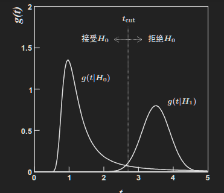

- 拒绝域：
  - 你看上面这个b图，如果H0正确的话，那么测出来的t处于2.7以上的位置是不是几率特别小？
  - 可以把2.7及以上的位置定义为拒绝域
  - 按照我们的假设H0，处在这个拒绝域概率很小，假设这个概率为5%吧！
  - 这个5%就叫做**显著水平**
  - 2.7这个位置就叫做tCut，**判选条件**
  - 现在来看，如果H0为真，那是不是有5%拒绝H0？，这个叫第一类误差

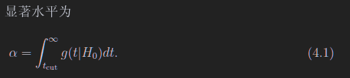

- 效力
  - 现在需要看g(t|H1)了，如果H1是真的，那么t测量出来比2.7小是不是概率很低？那么2.7就是tCut了，假设这个概率为7%，这个7%为显著水平
  - 现在我们看，我们先入为主，把H0认为零假设，测出来的t也让我们接受H0,但是这个时候H1是真的，此时这个7%称为第二类误差，也就是下面这个图的beta，同时可以定义效力

> 可以看出，我们的零假设不同，这些alpha和beta的值也不同
>
> alpha和beta都是两个分布的小脚，很好记

## 4.2 粒子选择的统计检验

在4.1中，把H0认为是电子，H1认为是pi，认为电子是目标，pi是背景。那么

**选择效率**

-  $\epsilon_e = 1 - \alpha$
- $\epsilon_\pi = \beta$

> 若pi是目标，那么
>
>  $\epsilon_e = \alpha$
>
> $\epsilon_\pi = 1 - \beta$

> 这玩意很好理解，就是由于tcut的原因，我们会舍去一些真正的电子和真正的pi

**纯度**

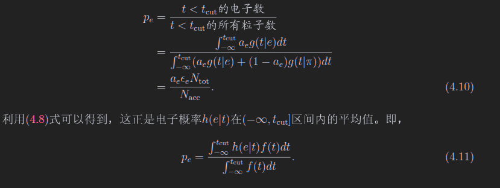

其中

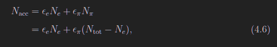

> 上图中，$a_e$和$a_\pi$题目会给的
>
> 纯度需要给定tCut

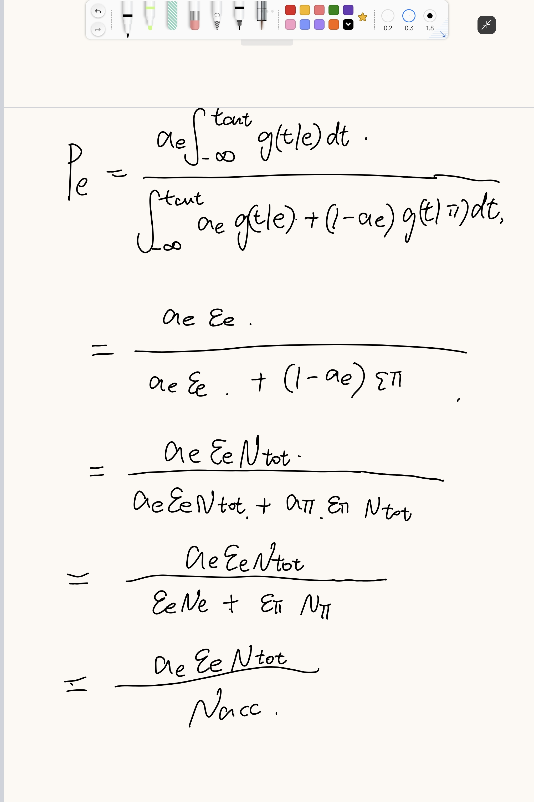

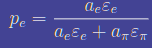

> 上面的式子更好理解，你把分子分母同乘以Ntotal，Ntotal再和比率去乘，就是电子和pi的数量，这个数量在去乘以选择效率，就是在tcut下的粒子数了

## 4.3 4.4 奈曼皮尔逊引理选择拒绝域以及构造统计量

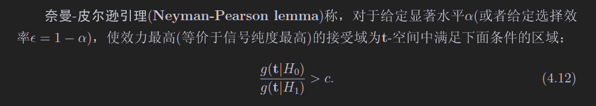

> 说人话：信噪比最高

> 就是找一个区域，信噪比高于这个给定比值

接下来干的事情是，构造统计量，并且使得统计量的概率密度函数分离最大

本章节为了简单，使用的统计量是原数据的线性函数

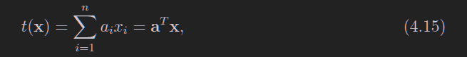

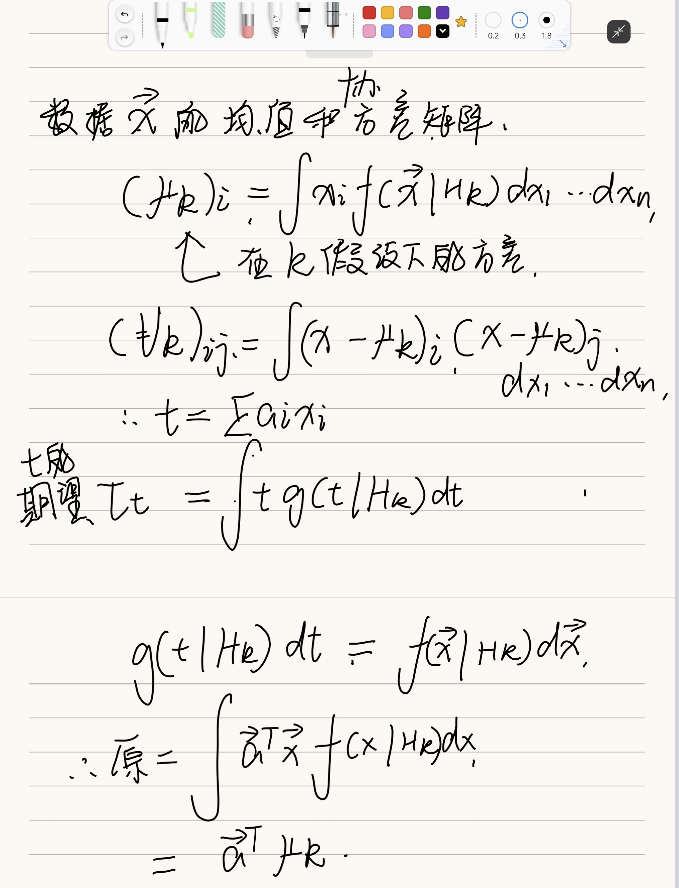

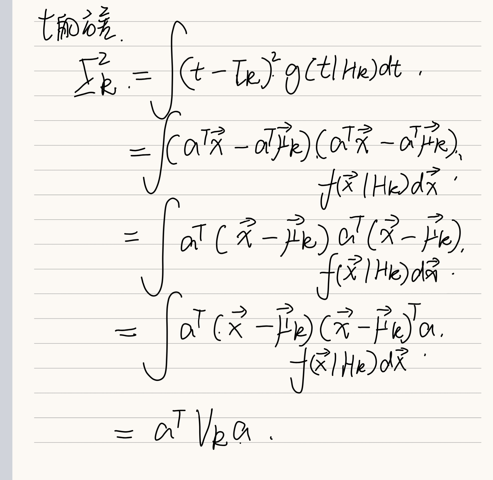

显然，每一个假设可以对应一个原始数据的期望及方差，t也是，每一个假设都有一个t的方差和期望，这个思想就是：**不同假设的t的期望差别很大不就行了？**

同时呢，**希望t的各个分布图像比较尖**，也就是方差小，于是，就构建了一个统计量

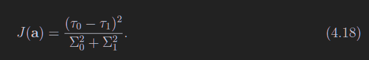

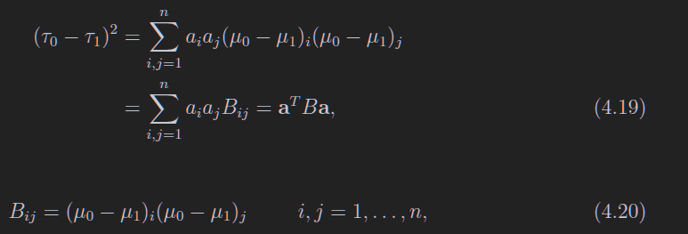

这个B如下表述清晰一些

---

$$
B = (\vec\mu_0 - \vec\mu_1)(\vec\mu_0 - \vec\mu_1)^T
$$

---

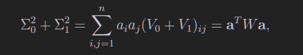

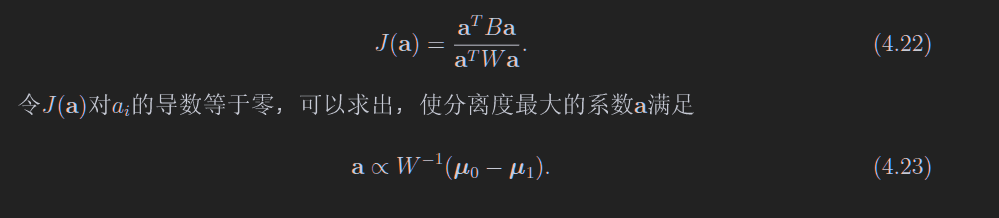

> 显然，B和W都是对称矩阵

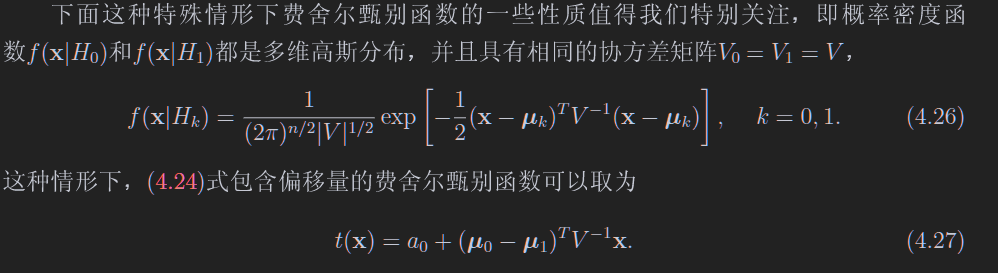

> **这个多维高斯的指数部分要记**
>
> 这里用了两个性质
>
> 1. W和V包括他们的逆矩阵是对称矩阵，所以这里没写T
> 2. a是正比于那个系数的（4.23）所以本来这里有个2，被吸收进去了

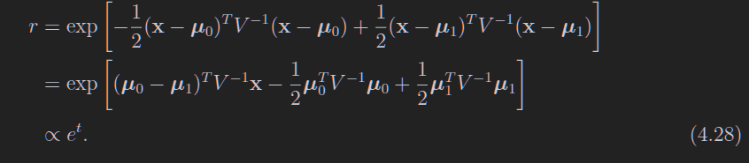

> 显然，这个r是用下面的这个算出来的，但是书上写的牛头不对马嘴

---

$$
r = \frac{f(x|H_0)}{f(x|H_1)}
$$

---

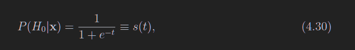

> **上式子省略了一个重要步奏**，那就是选择合适的a0,使得前面的系数消失,所以这里e前面没有系数
>
> ---
>
> $$
> \frac{\pi_1}{\pi_0} \exp[\frac{1}{2}\mu_0^T x \mu_0 - \frac{1}{2}\mu_1^Tx\mu_1 + a_0] = 1
> $$
>
> ---
>
> 如上所示

## 4.5 拟合优度检验

看看零假设和观测数据拟合的好不好

定义一个P，这是一个概率，简单来说，就是现在有个假设分布f(x)，然后呢我做了个实验，得到一个值，这个值与我假设分布的期望值有偏差，那现在我来看，在f(x)的分布下，测量一个新的值比现在的测量值更差的概率是多少，这个就是P

## *4.7 皮尔逊卡方检验

# 第五章 参数估计

## 5.2 样本均值、方差和协方差

### 不奇怪但是重要的公式

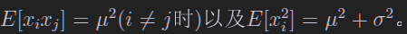

> 第一个是因为xi和xj独立，第二个是用的方差公式

### 大数弱定理

如果x的方差存在，则xbar为全平均的一致性估计量，这个看习题的5.1

**样本均值**

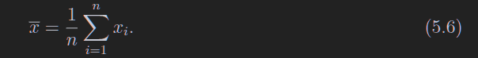

**样本方差**

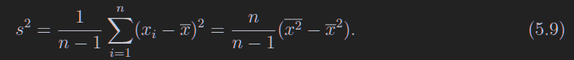

如果均值是知道的，那么就不需要n-1了

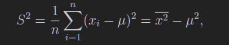

### 证明步骤

用上奇怪的公式，随便证明

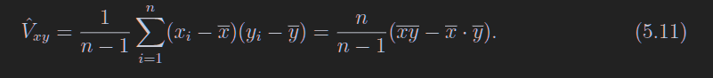

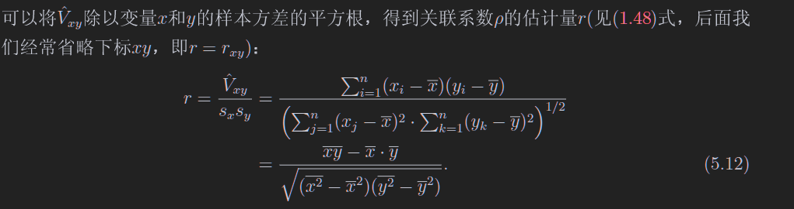

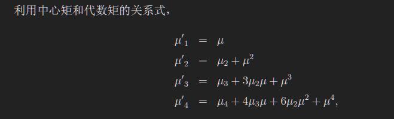

# 第六章 最大似然法

很简单的一个思想，假定一个带参数的分布$f(x;\theta)$

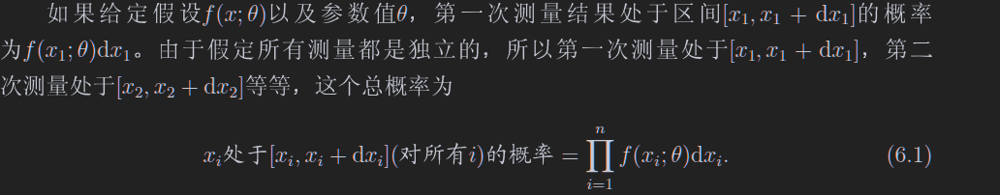

这个总概率最大，那么这个f不就可以尽量拟合数据的分布了吗

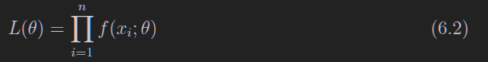

怎么求最大的概率呢？直接求导就行了

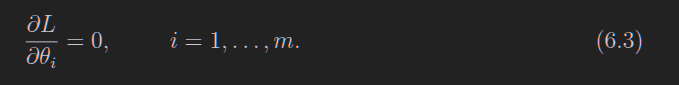

## 6.2 指数分布的最大似然函数

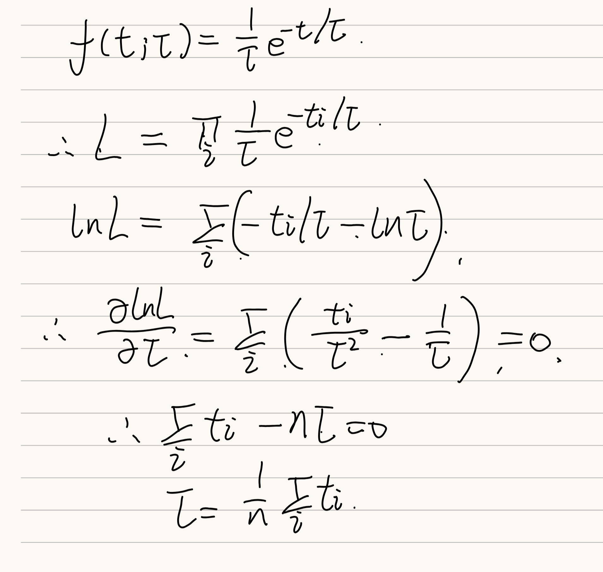

上面这个意味着，如果我想使用指数函数去拟合，那么就可以直接求个平均后往函数里面带

如果想换个变量，可以干下面的事情，只要a对theta的导数不是0,那么L对a的导数就是0,这样可以不用theta作为估计量，而换一个参数

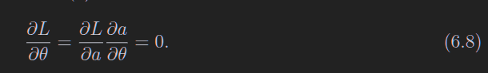

## 6.3 高斯分布的似然函数

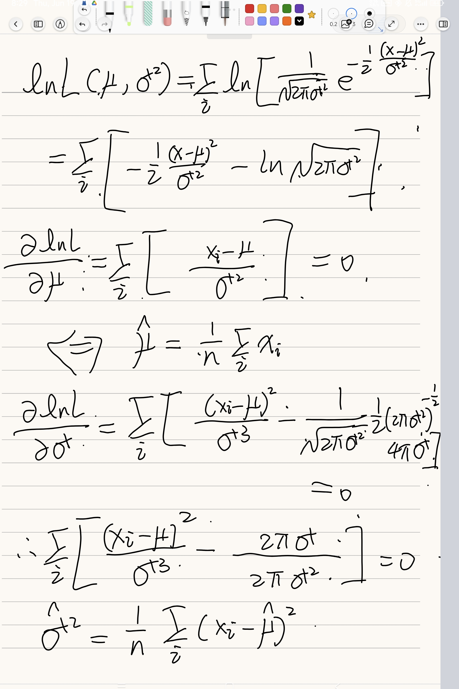
